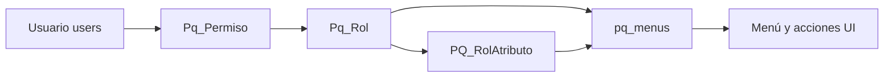

# Mantenimiento de roles y permisos

Documento de contexto que define los **procesos administrativos** para mantener roles, asignaciones usuario–rol y atributos granulares en el framework **MONO**, con adaptaciones explícitas para **PedidosWeb**.

Referencia de implementación previa: **PaqSuite-IA-Tango** — HU/TR-013 (permisos), HU/TR-012 (roles), HU/TR-014 (atributos de rol) y **TR-013 update 03** (asignación múltiple). En Tango la asignación es `usuario + empresa + rol`; aquí se elimina la dimensión **empresa** y, en PedidosWeb, el **ABM de usuarios**.

---

## Objetivo

Dejar explícitos:

- qué mantenimientos existen y quién puede operarlos;
- cómo se asignan permisos de forma **individual** y **masiva**;
- cómo se relacionan roles, `Pq_Permiso`, `PQ_RolAtributo` y el menú visible;
- qué **no** aplica en PedidosWeb respecto del producto Tango.

Este documento complementa `seguridad-permisos.md` (modelo de datos), `administracion-seguridad.md` (visión ABM) y `menu-y-autorizacion.md` (efecto en navegación).

---

## Alcance MONO vs Tango

| Tema | Tango (MULTI) | MONO / PedidosWeb |
|------|---------------|-------------------|
| Dimensión empresa | Selector de empresa activa; permiso = usuario + empresa + rol | Instalación única; permiso funcional = **usuario + rol** |
| Columna `IDEmpresa` / `id_empresa` | Parte de la regla de negocio | Valor fijo de instalación si el esquema legado la conserva; **no se muestra ni filtra en UI** |
| ABM de usuarios | Alta/edición/baja en portal | **Fuera de alcance PedidosWeb**: identidades provienen del **ERP** / sincronización |
| ABM de empresas | Proceso operativo | **No aplica** |
| Asignación individual | Formulario usuario + empresa + rol | Formulario **usuario + rol** |
| Asignación masiva | Tres modos: por usuario, por rol, **por empresa** | **Dos modos masivos**: por usuario y por rol (sin modo por empresa) |
| Autorización del ABM | `AccesoTotal` o atributos en opción de menú de permisos | Misma regla; sin validación por tenant |

Ver también `../05-variantes-y-alcance/mono-vs-multi-referencias.md`.

---

## Actores y prerrequisitos

### Quién opera

Accede a estos mantenimientos quien cumpla **alguna** de estas condiciones sobre la instalación:

- tiene un rol con **`AccesoTotal = true`** en `Pq_Rol` (perfil tipo supervisor), asignado vía `Pq_Permiso`, o
- tiene en **`PQ_RolAtributo`** al menos un permiso ABM (**Alta**, **Baja**, **Modificación** o **Consulta/Repo**) sobre la **opción de menú** del proceso correspondiente (roles, permisos o atributos).

La UI no debe exponer acciones que el backend rechazaría con **403**.

### Prerrequisitos de datos

| Mantenimiento | Requiere |
|---------------|----------|
| Asignación usuario–rol | Usuario existente en `users` (habilitado) y rol existente en `Pq_Rol` |
| Atributos de rol | Rol sin `AccesoTotal`; opciones en `pq_menus` |
| Roles | Ninguno obligatorio; conviene definir roles antes de asignar |

En **PedidosWeb**, el usuario debe existir previamente por **sync ERP** (`users`); no se crea desde el portal de seguridad.

---

## Modelo operativo (recordatorio)

- **`Pq_Rol`**: define el perfil y si tiene acceso total.
- **`Pq_Permiso`**: asigna uno o más roles a un usuario en la instalación.
- **`PQ_RolAtributo`**: cuando no hay acceso total, define capacidades por opción de menú (A/B/M/R).
- El **menú visible** y las **acciones en pantalla** son proyección de la unión de todos los roles del usuario.

Regla de unicidad en `Pq_Permiso`: la combinación **`(id_rol, id_usuario)`** no debe repetirse en MONO (equivalente funcional a la PK compuesta legada `(IDRol, IDEmpresa, IDUsuario)` con empresa constante).

Un usuario **puede tener varios roles** simultáneos; la autorización efectiva es la **unión** de permisos de todos ellos (`menu-y-autorizacion.md`).

---

## Procesos de mantenimiento

### 1. Mantenimiento de roles (`Pq_Rol`)

Proceso ABM sobre la definición de perfiles reutilizables.

| Operación | Comportamiento |
|-----------|----------------|
| Listar | Grilla con nombre, descripción, indicador de acceso total, estado de uso |
| Alta | Nombre obligatorio y único; descripción opcional; marcar o no `AccesoTotal` |
| Edición | Mismos campos; cambiar `AccesoTotal` a `true` simplifica el rol (no requiere atributos granulares para menú) |
| Baja | Solo si la política de integridad lo permite (rol no referenciado en `Pq_Permiso`) |

**Reglas:**

- Un rol con **`AccesoTotal = true`** no necesita mantenimiento fino de atributos para habilitar opciones de menú.
- Los atributos granulares se administran en proceso separado (§4).

Patrón UI: listado + modal según `../03-ui-transversal/patrones-abm.md`; controles DevExtreme.

---

### 2. Asignación de permisos (`Pq_Permiso`)

Gestión de la relación **usuario ↔ rol**. Es el núcleo del acceso operativo: sin al menos una fila válida, el login no habilita operación posterior (`login-y-sesion.md`).

Existen **tres modalidades** de asignación:

#### 2.1 Individual (usuario–rol)

Asignación **unitaria**: una fila por operación.

| Paso | Acción |
|------|--------|
| 1 | Abrir administración de permisos |
| 2 | Acción **Agregar** / **Crear permiso** |
| 3 | Seleccionar **usuario** (lookup o SelectBox con catálogo código–descripción) |
| 4 | Seleccionar **rol** |
| 5 | Confirmar guardado |

**Reglas:**

- Usuario y rol deben existir y estar habilitados según política del módulo.
- Si la combinación usuario + rol ya existe → error **422** con mensaje de duplicado.
- **Edición** habitual: cambiar el rol de una asignación existente (equivalente a modificar la fila).
- **Eliminación**: quita ese rol al usuario; si era su única asignación, pierde acceso al sistema.

Referencia Tango: flujo base TR-013 (alta individual con selects).

#### 2.2 Masivo por usuario (un usuario, varios roles)

Asignación en lote anclada a **un único usuario**.

| Paso | Acción |
|------|--------|
| 1 | Acción **Asignar por usuario** |
| 2 | Seleccionar **usuario** (ancla) |
| 3 | En grilla multi-selección, tildar **roles** a otorgar |
| 4 | Revisar resumen: cantidad de permisos a crear |
| 5 | Confirmar |

**Producto de combinaciones:** por cada rol tildado → una fila `Pq_Permiso` con `(id_usuario fijo, id_rol)`.

Ejemplo: usuario U + roles R1, R2, R3 → hasta 3 filas nuevas (omitir las ya existentes).

Referencia Tango: TR-013 update 03 modo `by_user`, **sin** grilla de empresas.

#### 2.3 Masivo por rol (un rol, varios usuarios)

Asignación en lote anclada a **un único rol**.

| Paso | Acción |
|------|--------|
| 1 | Acción **Asignar por rol** |
| 2 | Seleccionar **rol** (ancla) |
| 3 | En grilla multi-selección, tildar **usuarios** |
| 4 | Revisar resumen de altas |
| 5 | Confirmar |

**Producto de combinaciones:** por cada usuario tildado → una fila `Pq_Permiso` con `(id_rol fijo, id_usuario)`.

Ejemplo: rol R + usuarios U1, U2, U3 → hasta 3 filas nuevas.

Referencia Tango: TR-013 update 03 modo `by_role`, **sin** grilla de empresas.

#### 2.4 Reglas comunes a las tres modalidades

| Regla | Detalle |
|-------|---------|
| Duplicados | Combinaciones ya existentes se **omiten**; el resumen informa creados vs omitidos (política preferida; alternativa fail-fast documentada en implementación) |
| Validación UI previa | Sin ancla (usuario o rol según modo) o sin filas tildadas → mensaje claro; **no** invocar API |
| Cartesiano vacío | Ancla elegida pero cero selecciones en grilla obligatoria → «No hay permisos por asignar» |
| Confirmación | Diálogo previo con cantidad estimada de registros |
| Alcance masivo | **In scope:** altas en lote. **Out of scope:** edición o eliminación masiva |
| Impacto inmediato | Tras guardar, el usuario afectado ve menú/acciones según unión de roles en **próximo login** o refresh de sesión según implementación |

**Listado y filtros** del ABM individual: grilla de asignaciones con columnas usuario, rol, fecha; filtros por usuario y/o rol.

---

### 3. Usuarios: consulta, no mantenimiento (PedidosWeb)

En el producto **PedidosWeb** no existe ABM de usuarios en el portal.

| Permitido | No permitido |
|-----------|--------------|
| Listar / buscar usuarios sincronizados desde ERP | Alta de usuario |
| Usar usuario como lookup en asignación de permisos | Edición de credenciales o datos maestros |
| Ver estado habilitado/inhabilitado si el sync lo expone | Baja lógica desde UI de seguridad |

La provisión de identidades es responsabilidad del **ERP** y de los procesos de sincronización (`paqsuite:sync-pedidosweb-login-from-users` u equivalente documentado en producto).

En otros productos MONO del framework, el ABM de usuarios puede existir; ver `administracion-seguridad.md` § usuarios como referencia genérica.

---

### 4. Mantenimiento de atributos de rol (`PQ_RolAtributo`)

Aplica cuando el rol tiene **`AccesoTotal = false`**.

| Operación | Comportamiento |
|-----------|----------------|
| Acceso | Desde mantenimiento de roles → acción **Atributos** del rol |
| Vista | Árbol o grilla de opciones de `pq_menus` |
| Configuración | Marcar Alta / Baja / Modificación / Consulta por opción |
| Unicidad | Una fila por combinación rol + procedimiento/opción de menú |

Estos atributos gobiernan:

- visibilidad de ítems en el sidebar;
- habilitación de acciones ABM en pantallas (`VisibilityPermissionGuard` y equivalentes).

Referencia Tango: HU/TR-014.

---

## Contratos de API (orientativos)

Alineados al patrón Tango `/api/v1/admin/permisos`, adaptados a MONO:

| Operación | Contrato sugerido |
|-----------|-------------------|
| Listar asignaciones | `GET /api/v1/admin/permisos` — filtros `usuario_id`, `rol_id` |
| Alta individual | `POST /api/v1/admin/permisos` — body `{ id_usuario, id_rol }` |
| Edición | `PUT /api/v1/admin/permisos/{id}` — cambio de rol |
| Baja | `DELETE /api/v1/admin/permisos/{id}` |
| Alta masiva | `POST /api/v1/admin/permisos/batch` — body `{ mode: 'by_user' \| 'by_role', anchorId, rolIds[] \| usuarioIds[] }` |
| Respuesta batch | `{ creados, omitidos, errores[] }` en envelope estándar del proyecto |

Errores: **401** no autenticado; **403** sin autorización para el proceso; **422** validación o duplicado.

En MONO, `id_empresa` se resuelve en backend con constante de instalación si el esquema físico lo exige; no viaja en el body del cliente.

---

## UI y experiencia

### Patrón de pantallas

- **Permisos:** grilla principal (ABM individual) + toolbar con **Agregar**, **Asignar por usuario** y **Asignar por rol** (dos flujos masivos; sin «por empresa»).
- **Modales masivos:** ancla (SelectBox) + DataGrid DevExtreme con `selection.mode = multiple` para el catálogo secundario.
- **Roles / Atributos:** ABM estándar según `patrones-abm.md`.

### i18n y testabilidad

Convención alineada a **PaqSuite-IA-Tango** (`PermisosAdminPage`, `PermisoBulkModal`): claves con notación de puntos; en PedidosWeb van en `frontend/src/locales/*.json` (formato plano, misma key). Idiomas obligatorios del framework: **es, en, pt, fr, it**.

#### Permisos (`admin.permisos.*`)

| Clave | Uso |
|-------|-----|
| `admin.permisos.title` | Título pantalla |
| `admin.permisos.create` | Botón alta individual |
| `admin.permisos.empty` | Grilla sin filas |
| `admin.permisos.usuario` | Columna / label usuario |
| `admin.permisos.nombreUsuario` | Columna nombre usuario |
| `admin.permisos.rol` | Columna / label rol |
| `admin.permisos.deleteHint` | Tooltip eliminar |
| `admin.permisos.confirmDelete` | Confirmación baja |
| `admin.permisos.deleteError` | Error al eliminar |
| `admin.permisos.loadError` | Error al cargar listado |
| `admin.permisos.loadOptionsError` | Error catálogos en modal |
| `admin.permisos.saveError` | Error al guardar / batch |
| `admin.permisos.bulk.byUser` | Botón y título modal «por usuario» |
| `admin.permisos.bulk.byRole` | Botón y título modal «por rol» |
| `admin.permisos.bulk.validationNoAnchor` | Falta ancla (`{{field}}` = usuario o rol) |
| `admin.permisos.bulk.validationSinCombinaciones` | Ancla ok pero cero filas tildadas → «No hay permisos por asignar» |
| `admin.permisos.bulk.successMessage` | Resumen post-batch (`{{creados}}`, `{{omitidos}}`) |

**No usar en MONO / PedidosWeb:** `admin.permisos.empresa`, `admin.permisos.bulk.byCompany` (solo referencia Tango MULTI).

Transversales reutilizables: `common.loading`, `common.confirm`, `common.noOptions`, `abm.*` donde aplique patrón ABM genérico.

#### Roles (`admin.roles.*`)

| Clave | Uso |
|-------|-----|
| `admin.roles.title` | Título pantalla |
| `admin.roles.create` | Alta rol |
| `admin.roles.empty` | Grilla vacía |
| `admin.roles.nombre` | Campo / columna nombre |
| `admin.roles.descripcion` | Campo descripción |
| `admin.roles.accesoTotal` | Indicador acceso total |
| `admin.roles.atributos` | Acción / enlace a atributos |
| `admin.roles.atributosHint` | Tooltip atributos |
| `admin.roles.editHint` | Tooltip editar |
| `admin.roles.loadError` | Error al cargar |

#### `data-testid` (estables)

| Ámbito | Valores |
|--------|---------|
| Pantalla | `permisos.admin`, `permisos.grid`, `permisos.create`, `permisos.delete` |
| Bulk toolbar | `permisos.bulk.byUser`, `permisos.bulk.byRole` |
| Modales bulk | `permisos.bulk.modal.byUser`, `permisos.bulk.modal.byRole` |
| Anclas | `permisos.bulk.anchor.usuario`, `permisos.bulk.anchor.rol` |
| Grillas selección | `permisos.bulk.grid.roles`, `permisos.bulk.grid.usuarios` |
| Acciones | `permisos.bulk.confirm`, `permisos.bulk.validation` (`role="alert"`) |

Catálogos FK: convención **código – descripción** en lookups.

---

## Efecto en login, menú y sesión

| Evento | Efecto |
|--------|--------|
| Nueva asignación usuario–rol | Usuario puede acceder si antes no tenía permisos; menú se amplía según unión de roles |
| Eliminación de asignación | Si queda sin filas en `Pq_Permiso` → login posterior falla (403 / sin permiso) |
| Varios roles | Menú = unión de opciones; acciones = unión de atributos A/B/M/R |
| Rol con `AccesoTotal` | Ese rol aporta acceso a todas las opciones `enabled` del menú |
| Cambio de atributos | Afecta visibilidad y acciones sin alterar `Pq_Permiso` |

El frontend **no recalcula** permisos localmente para el sidebar; consume la API de menú del usuario (`menu-y-autorizacion.md`).

---

## Estado MVP vs mantenimiento futuro

| Aspecto | MVP actual (PedidosWeb) | Mantenimiento documentado aquí |
|---------|-------------------------|------------------------------|
| Carga inicial | `paqsuite:seed-seguridad-mvp` (roles, permisos, atributos, usuarios de prueba) | — |
| UI de administración | Fuera de alcance MVP (SPEC-001-02) | Objetivo de HUs futuras |
| Usuarios | Seed de prueba + sync ERP | Solo sync en producción; sin ABM |
| Roles por usuario | Seed típicamente **un rol por usuario** de prueba | ABM permite **N roles por usuario** |
| Asignación masiva | No implementada | Definida; referencia Tango TR-013 update 03 |

El seed MVP puede seguir usando una asignación simple por usuario; el modelo físico y este documento contemplan multi-rol para el mantenimiento operativo.

---

## Derivaciones esperables

Este documento sirve de base para:

- HU de administración de permisos (individual + masivo por usuario + masivo por rol) — ver [HU-GEN-02-admin-permisos](../../03-historias-usuario/001-Generaliddes/HU-GEN-02-admin-permisos.md), [HU-GEN-02-admin-permisos-bulk](../../03-historias-usuario/001-Generaliddes/HU-GEN-02-admin-permisos-bulk.md);
- HU de administración de roles y atributos de rol — ver [HU-GEN-02-admin-roles](../../03-historias-usuario/001-Generaliddes/HU-GEN-02-admin-roles.md), [HU-GEN-02-admin-rol-atributos](../../03-historias-usuario/001-Generaliddes/HU-GEN-02-admin-rol-atributos.md);
- specs de API batch y pantallas DevExtreme;
- tests Feature (batch, duplicados, 403) y E2E de validaciones bulk;
- manual de usuario de seguridad (sin sección ABM usuarios en PedidosWeb).

## Relación con otros temas

- SPEC ([revisión A1 cerrada](../../../05-open-spec/001-Generaliddes/SPEC-001-02-admin-mantenimiento-roles-permisos.md#revisión-a1--cierre-2026-06-18)): `SPEC-001-02-admin-mantenimiento-roles-permisos.md`
- Resumen conceptual: `usuarios-roles-permisos-resumen.md`
- Modelo de tablas: `seguridad-permisos.md`
- Visión ABM genérica: `administracion-seguridad.md`
- Menú y autorización: `menu-y-autorizacion.md`
- Login: `login-y-sesion.md`
- MONO vs MULTI: `../05-variantes-y-alcance/mono-vs-multi-referencias.md`
- Patrones UI: `../03-ui-transversal/patrones-abm.md`

## Referencias externas (Tango)

| Documento | Uso en este repo |
|-----------|------------------|
| [HU-013 — Permisos](https://github.com/paqsystems/PaqSuite-IA-TANGO/blob/main/docs/03-historias-usuario/001-Seguridad/HU-013-administracion-permisos.md) | ABM individual |
| [TR-013 update 03 — Asignación múltiple](https://github.com/paqsystems/PaqSuite-IA-TANGO/blob/main/docs/04-tareas/updates/001-Seguridad/TR-013-administracion-permisos-update-03-asignacion-multiple.md) | Flujos masivos (adaptar: quitar empresa) |
| [HU/TR-012 — Roles](https://github.com/paqsystems/PaqSuite-IA-TANGO/blob/main/docs/04-tareas/001-Seguridad/TR-012-administracion-roles.md) | Mantenimiento de roles |
| [HU/TR-014 — Atributos de rol](https://github.com/paqsystems/PaqSuite-IA-TANGO/blob/main/docs/04-tareas/001-Seguridad/TR-014-administracion-atributos-rol.md) | Permisos granulares |
| [Manual Seguridad Tango](https://github.com/paqsystems/PaqSuite-IA-TANGO/blob/main/docs/99-Manual-Usuario/seguridad.md) | Flujos operativos (adaptar sin empresa ni ABM usuarios) |
