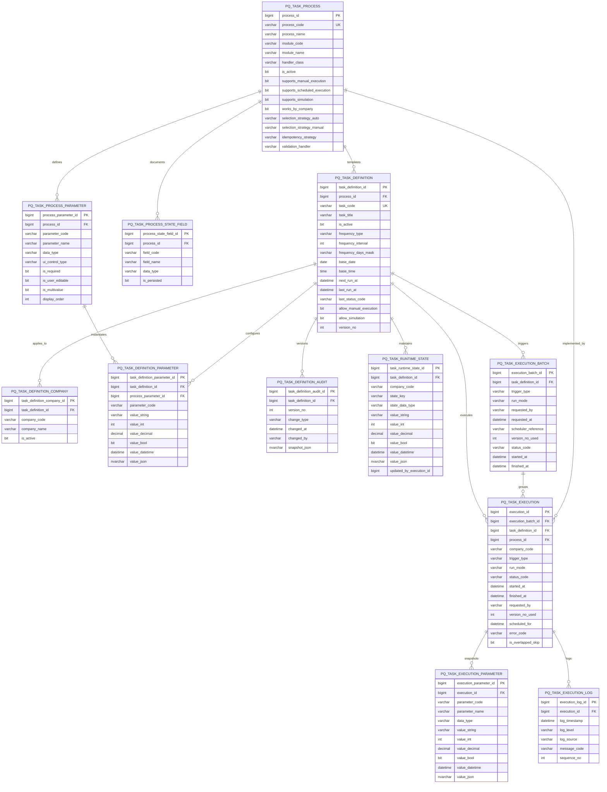

# Diagrama Mermaid — Modelo de datos de tareas automáticas programadas

## Lectura rápida del diagrama

- `PQ_TASK_PROCESS` representa el catálogo técnico de procesos programables.
- `PQ_TASK_DEFINITION` representa la tarea configurada por el usuario.
- `PQ_TASK_DEFINITION_COMPANY` permite asociar varias empresas a una misma tarea.
- `PQ_TASK_RUNTIME_STATE` separa el estado interno técnico de los parámetros visibles.
- `PQ_TASK_EXECUTION_BATCH` agrupa un disparo general.
- `PQ_TASK_EXECUTION` guarda la corrida concreta por empresa.
- `PQ_TASK_EXECUTION_PARAMETER` congela los parámetros usados en esa corrida.
- `PQ_TASK_EXECUTION_LOG` guarda el detalle cronológico de mensajes.

## Sugerencia de uso

Este archivo sirve para:

- validar visualmente la arquitectura,
- detectar redundancias o faltantes,
- discutir ajustes antes de cerrar SQL definitivo,
- y luego usarlo como apoyo para la documentación técnica de Cursor.
