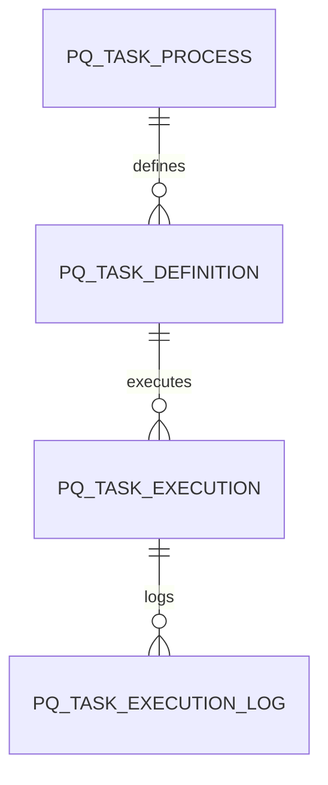

# 📘 Documentación Premium — Subsistema de Tareas Programadas

## 1. Introducción
Este documento consolida el diseño completo del subsistema de tareas programadas:
- Diseño conceptual
- Modelo de datos
- Modelo SQL Server
- Diagrama Mermaid
- Documentación técnica para implementación (Laravel + Cursor)

---

## 2. Diseño Conceptual

### Componentes principales
1. Catálogo de procesos programables  
2. Definición de tareas  
3. Ejecución (manual / automática / simulación)  
4. Logs e historial  

### Principios clave
- Separación de responsabilidades (configuración vs ejecución vs estado vs logs)
- Un único motor de ejecución
- Snapshot de parámetros por ejecución
- Soporte multiempresa
- Idempotencia por proceso

---

## 3. Modelo de Datos (Resumen)

Entidades principales:
- PQ_TASK_PROCESS
- PQ_TASK_DEFINITION
- PQ_TASK_DEFINITION_PARAMETER
- PQ_TASK_RUNTIME_STATE
- PQ_TASK_EXECUTION_BATCH
- PQ_TASK_EXECUTION
- PQ_TASK_EXECUTION_PARAMETER
- PQ_TASK_EXECUTION_LOG

### Separaciones clave
- Configuración → PQ_TASK_DEFINITION*
- Estado interno → PQ_TASK_RUNTIME_STATE
- Ejecución → PQ_TASK_EXECUTION*
- Logs → PQ_TASK_EXECUTION_LOG

---

## 4. Diagrama Mermaid



---

## 5. Modelo SQL (Resumen)

Ejemplo:

```sql
CREATE TABLE PQ_TASK_EXECUTION (
    execution_id BIGINT IDENTITY PRIMARY KEY,
    task_definition_id BIGINT,
    status_code VARCHAR(30),
    started_at DATETIME2,
    finished_at DATETIME2
);
```

---

## 6. Arquitectura Técnica (Laravel)

### Capas
- Models (Eloquent)
- Services
- Process Handlers
- Scheduler

---

## 7. Contrato de Procesos

```php
interface TaskProcessInterface {
    public function validate($context);
    public function execute($context);
}
```

---

## 8. Motor de Ejecución

Flujo:
1. Crear batch
2. Crear ejecución por empresa
3. Guardar parámetros
4. Ejecutar proceso
5. Loguear
6. Finalizar estado

---

## 9. Scheduler

```php
$schedule->call(fn() => app(TaskSchedulerService::class)->run())->everyMinute();
```

---

## 10. Endpoints

- GET /tasks
- GET /tasks/{id}
- POST /tasks/{id}/execute
- GET /executions/{id}/logs

---

## 11. Estados

- EN_EJECUCION
- EXITOSA
- EXITOSA_CON_OBSERVACIONES
- FALLIDA
- OMITIDA

---

## 12. Simulación

- Ejecuta lógica
- No genera efectos reales
- Sí genera logs

---

## 13. Reglas Clave

- No solapamiento
- No reintentos automáticos
- Ejecución manual no altera calendario
- Logs obligatorios

---

## 14. Casos Reales

### Autorización de pedidos
- Parámetros: talonario, tolerancia, mails
- Resultado: Excel + mail

### Envío de comprobantes
- Automático: todos pendientes
- Manual: selección usuario

---

## 15. Conclusión

Este diseño permite:
- Escalabilidad
- Mantenibilidad
- Integración con IA (Cursor)
- Evolución futura (colas, microservicios)

---

## ✔ Documento listo para:
- Desarrollo
- Presentación
- Base de implementación
