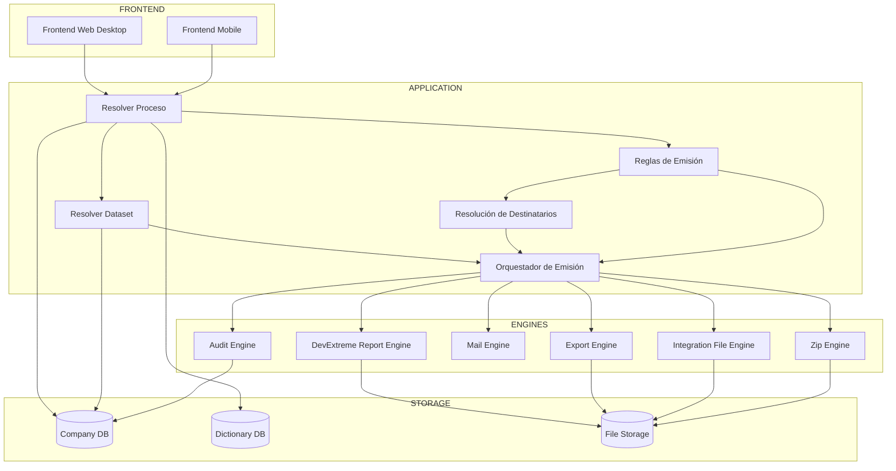

# Contenedores del Subsistema de Emisión

El sistema separa responsabilidades en capas:

- Frontend
- Aplicación
- Motores especializados
- Persistencia

---

```mermaid
flowchart TB

    subgraph FRONTEND

        WEB[Frontend Web Desktop]
        MOB[Frontend Mobile]

    end


    subgraph APPLICATION

        PROC[Resolver Proceso]
        DATA[Resolver Dataset]
        RULES[Reglas de Emisión]
        DEST[Resolución de Destinatarios]
        ORCH[Orquestador de Emisión]

    end


    subgraph ENGINES

        REP[DevExtreme Report Engine]
        EXP[Export Engine]
        MAIL[Mail Engine]
        INT[Integration File Engine]
        ZIP[Zip Engine]
        AUD[Audit Engine]

    end


    subgraph STORAGE

        CDB[(Company DB)]
        DDB[(Dictionary DB)]
        FILES[(File Storage)]

    end


    WEB --> PROC
    MOB --> PROC

    PROC --> DATA
    PROC --> RULES

    RULES --> DEST

    DATA --> ORCH
    DEST --> ORCH
    RULES --> ORCH

    ORCH --> REP
    ORCH --> EXP
    ORCH --> MAIL
    ORCH --> INT
    ORCH --> ZIP
    ORCH --> AUD

    PROC --> CDB
    PROC --> DDB

    DATA --> CDB

    REP --> FILES
    EXP --> FILES
    INT --> FILES
    ZIP --> FILES

    AUD --> CDB
```
