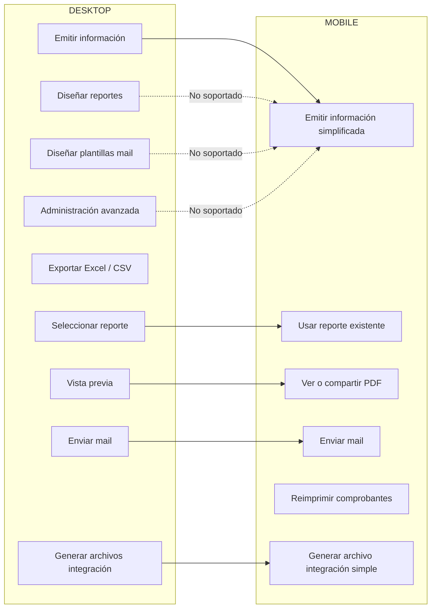

# Capacidades Desktop vs Mobile

El sistema distingue entre funcionalidades disponibles en Desktop y Mobile.

Mobile se orienta a **ejecución rápida**, no a configuración.

---

```mermaid
flowchart LR

subgraph DESKTOP

D1[Emitir información]
D2[Seleccionar reporte]
D3[Vista previa]
D4[Enviar mail]
D5[Exportar Excel / CSV]
D6[Generar archivos integración]
D7[Diseñar reportes]
D8[Diseñar plantillas mail]
D9[Administración avanzada]

end


subgraph MOBILE

M1[Emitir información simplificada]
M2[Usar reporte existente]
M3[Ver o compartir PDF]
M4[Enviar mail]
M5[Reimprimir comprobantes]
M6[Generar archivo integración simple]

end


D1 --> M1
D2 --> M2
D3 --> M3
D4 --> M4
D6 --> M6

D7 -. No soportado .-> M1
D8 -. No soportado .-> M1
D9 -. No soportado .-> M1
```

