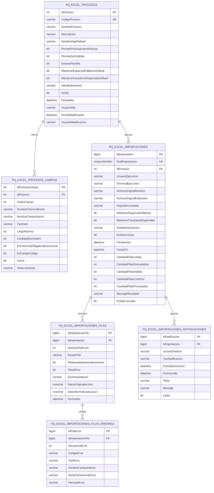

# PQ_EXCEL - Diagrama Mermaid

## Lectura del diagrama

- **`PermiteProcesamientoParcial`** en `PQ_EXCEL_PROCESOS`: por cada proceso, define si ≥ 1 fila con error permite o no procesar el resto de filas válidas (ver documento conceptual §6.1).
- Un proceso puede tener muchos campos definidos.
- Un proceso puede tener muchas importaciones ejecutadas.
- Cada importación tiene muchas filas en staging.
- Cada fila puede tener muchos errores detallados.
- Cada importación puede generar varias notificaciones internas.

## Sugerencia visual

Si después querés, puedo generarte una segunda versión del Mermaid:
- más ejecutiva y resumida
- o una más técnica, con foco en staging y auditoría.
